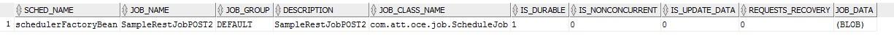
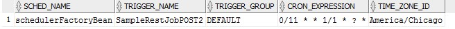
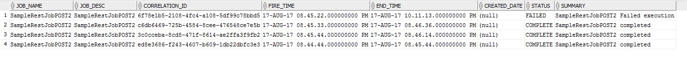

## Scheduler Service

	Scheduler service lets you create a Job which can be scheduled to run at predefined intervals using a cron expression.
	Every Microservice that needs to perform a repetitive Job, needs to expose a rest end point which can be invoked by the scheduler passing the data if required. 
	
### Creating a Scheduled Job

	A new scheduled Job can be created by invoking the rest service exposed in the scheduler service.
		API : /schedulerService/schedule
		Request :
		{
		"event": {
		"jobName": "SampleRestJob",
		"apiURL": "http://localhost:9011/oce/api/createorder",
		"jobSchedule": "0/11 * * 1/1 * ? *",
		"apiMethod": "POST",
		"jobDescription": "SampleRestJob"
		},
		"data": {
		}
		}
		
	The Scheduler Service will accept the following parameters
		jobName - Name of the Job to be scheduled
		apiURL - The Rest URL to be invoked by the scheduler instance. The API should send a synchronous ACK response once the Scheduler invoked the Rest service. 
		jobSchedule - The Cron expression which define when to run this Job.
		apiMethod - The Rest API Method - whether it is POST or PUT. 
		jobDescription - Detailed description about what the Job does. 
		data (optional) - If any request body for the Rest API to be invoked. It should be a Json request. 

### Job Details

	This will give the details of all the Jobs scheduled
	

 
### Cron Details

	This will give the Cron schedule details of all the Job
	

 
### Job History

	This table is used to log the Job history for every Job run. This data can be exposed AS-IS to the UI to get the Job history details.
		Once the Scheduler invoke the Rest API, it will log an entry in the Job History table with the Job name and the Status as 'TRIGGERED'
		Once the Rest API respond with an ACK response, the status of the job will be updated with Status as 'STARTED'
		Once the Rest API completes its processing, it should do a call back by invoking the /schedulerService/updateStatus service to update the Job status as 'COMPLETED' or 'FAILED' along with the summary description.
		

		
### Job Status Update Call back

	Once the Rest API completes the required functionality, it needs to invoke a call back url to update the status of the run. 
	The correlationId will be the unique ID generated for each run. This ID will be passed to the Rest API in the header when the Scheduler invokes the Rest API.
	This updateStatus API will update the final status of each Job run in the Job History table.

		API : /schedulerService/updateStatus
		Request :
		{
		"jobName": "SampleRestJobPOST2",
		"correlationId": "6f78e1b5-2108-4fc4-a108-5df99c78bbd5",
		"jobStatus": "COMPLETED",
		"jobSummary": "SampleRestJobPOST2 completed execution and updated 100 records"
		}

